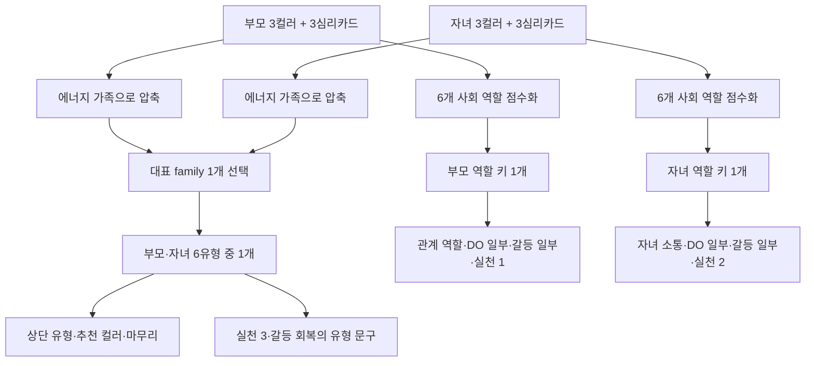

# 부모·자녀 관계 분석 생성 로직 진단

> **결론:** 현재 Production 부모·자녀 결과는 **③ 관계 유형 템플릿과 컬러·심리카드 기반 역할 키 생성이 혼합된 구조**입니다. 다만 컬러·심리카드가 개별 조합의 생활기질을 직접 서술하는 방식이 아니라, 대부분 **6개 역할 키 중 하나로 압축**된 뒤 해당 역할의 고정 문장 묶음을 여러 섹션에서 재사용합니다. 따라서 서로 다른 실제 조합도 같은 역할 키에 모이면, 사용자가 지적한 “부모가 대화를 이어가려 함 → 자녀는 생각할 시간 필요 → 압박으로 느낌 → 기다리고 질문함” 흐름이 반복됩니다.

## 1. 세 가지 판단에 대한 답

| 질문 | 진단 | 근거 |
|---|---|---|
| ① 관계 유형 중심 템플릿인가 | **예. 상단 관계 유형·추천 컬러·마무리 메시지는 명백히 관계 유형 템플릿 중심입니다.** | 부모·자녀는 대표 에너지 가족 조합에 따라 보호자형·기대압박형·정서연결형·성장지원형·표현서툼형·거리조율형 중 하나를 고르고, 해당 유형에 미리 묶인 제목·설명·추천 컬러·마무리 문장을 그대로 사용합니다. |
| ② 컬러 조합 중심 동적 생성인가 | **부분적으로만 예.** 사회적 역할은 3컬러·3카드의 점수 합으로 역할 키를 고르지만, 실제 본문은 그 역할 키의 고정 템플릿입니다. | 컬러·카드·도형이 `connector/healer/analyst/leader/artist/expert` 6개 역할에 점수로 매핑되고, 가장 높은 역할 하나가 선택됩니다. |
| ③ 두 방식이 혼합되는가 | **예. 현재 구조의 정확한 상태입니다.** | 상단·추천·마무리는 관계 유형 템플릿, 중간 5개 섹션과 실천은 부모 역할 키·자녀 역할 키·관계 유형 이름을 조합한 템플릿입니다. |

## 2. 실제 데이터 흐름

## 3. 관계 유형 템플릿이 직접 지배하는 영역

부모·자녀 경량 유형 선택은 각 사람의 3컬러를 7개 에너지 가족으로 압축한 뒤, **대표 family 하나씩**으로 결정합니다. 1순위는 가중치 2, 2순위와 3순위는 각각 가중치 1입니다. 즉 3순위는 회복 방향으로 분리되지 않고 대표 family 계산에 여전히 포함됩니다.

| 화면 섹션 | 실제 데이터 원천 | 동적 범위 | 반복이 생기는 이유 |
|---|---|---|---|
| 상단 `관계 유형`·핵심 설명 | `PARENT_CHILD_ARCHETYPE_DATA`의 6개 고정 레코드 | 대표 family 조합으로 6유형 중 하나 선택 | 같은 유형이면 제목·요약·본문이 동일 |
| 추천 컬러 | 위 6개 유형 레코드의 `recommendedColors` | 유형 변경 시만 변경 | 실제 부모 1·2순위와 자녀 1·2순위를 다시 조합해 추천하지 않음 |
| 마무리 코칭 메시지 | 위 6개 유형 레코드의 `closingMessage` | 유형 변경 시만 변경 | 같은 유형이면 문장이 동일 |
| 3가지 실천 중 3번째 | 유형 이름의 문자열 포함 여부 | 성장·지원, 거리, 감정·공감 등의 유형별 한 문장 분기 | 실제 조합의 생활 장면을 새로 뽑지 않고 유형 라벨을 사용 |
| 갈등·회복의 마지막 문장 | 유형 이름을 끼운 고정 문장 | 유형 이름만 달라짐 | 회복 순서의 주된 골격은 동일 |

### 코드 근거

`getParentChildArchetype`은 대표 family만 받아 다음의 고정 분기를 수행합니다.

> `warm_soft` 또는 `nature`가 한 명에게라도 있으면 `성장지원형`을 반환하고, `neutral` 또는 `cool_clear`가 있으면 `거리조율형`을 반환합니다.

따라서 그린·세이지·라벤더가 서로 어떤 순서와 역할로 놓였는지, 옐로우·핑크·코랄이 실제로 어떤 생활 장면에서 만나는지는 이 단계에서 읽히지 않습니다. 에너지 가족이라는 넓은 범주만 남습니다.

## 4. 컬러·심리카드가 실제로 동적으로 쓰이는 영역

`buildParentChildCoaching`은 부모와 자녀의 3컬러·3카드를 `buildLifeRoleEnergyReport`에 전달합니다. 이 보고서는 컬러·카드 컬러·도형을 각각 6개 역할 중 하나 또는 둘로 매핑해 가중치를 합산합니다.

| 입력 | 현재 가중치 | 실제 효과 |
|---|---:|---|
| 1순위 컬러 | 1.30 | 역할 키 선택에 가장 큰 개별 컬러 가중치 |
| 2순위 컬러 | 1.05 | 역할 키 선택에 계속 직접 참여 |
| 3순위 컬러 | 0.95 | **회복 방향으로 격리되지 않고**, 역할 키 선택에 계속 직접 참여 |
| 1번 심리카드의 카드 컬러 | 1.15 | 역할 키 선택에 직접 참여 |
| 2번 심리카드의 카드 컬러 | 1.00 | 역할 키 선택에 직접 참여 |
| 3번 심리카드의 카드 컬러 | 0.90 | 역할 키 선택에 직접 참여 |
| 각 카드 도형 | 각 역할 +0.35 | 역할 키 선택에 직접 참여 |

따라서 **입력 자체는 동적**입니다. 그러나 합산 후에는 각 사람마다 최종 역할 키 하나로 축소됩니다. 예를 들면 그린·세이지·라벤더, 레드·화이트·블루 등 서로 다른 조합이 최종적으로 같은 `connector` 또는 `analyst`에 도달하면, 이후 자녀 소통·DO & DON'T·갈등·실천 문장은 같은 레코드에서 나옵니다.

또한 `ParentChildCoachingInput`에는 부모·자녀의 `analysis: PersonAnalysis`가 전달되지만, 생성기 내부에서는 `input.parent.analysis`과 `input.child.analysis`를 조회하지 않습니다. 즉 개인 컬러×심리카드 통합 분석에서 이미 생성한 더 구체적인 욕구·현재 반응·회복 흐름은 부모·자녀 종합 코칭 문장에 재사용되지 않습니다.

## 5. 중간 5개 섹션의 실제 생성 방식

| 섹션 | 실제 입력 | 생성 방식 | 관계 유형의 개입 | 사용자 지적 반복과의 연결 |
|---|---|---|---|---|
| 각자의 사회적 역할 | 각자의 3컬러·3카드 | 역할 키 1개와 첫째·둘째 컬러의 짧은 문구로 역할 설명 템플릿 조립 | 없음 | 조합이 달라도 같은 역할 키면 제목·강점 문장 골격이 유사 |
| 우리 관계의 역할 에너지 | 부모 역할 키 1개 + 자녀 역할 키 1개 | `PARENT_RELATIONSHIP_ROLE`·`CHILD_RELATIONSHIP_ROLE`의 고정 역할 카드 | 통합 문단 끝에 유형 이름만 삽입 | 역할 키가 같으면 “압박·통제·한 번에 하나의 약속” 문장이 반복 |
| 자녀 기질 맞춤 소통 | **자녀 역할 키 1개** | `CHILD_CLOSES_WHEN`·`CHILD_CONFIDENCE_WHEN` 6개 문장 중 선택 | 없음 | `analyst`라면 “충분히 이해 전 결론 요구 → 생각할 시간”, `expert`라면 “준비 전 요구 → 더 조용해짐”처럼 역할별 고정 서사 |
| 부모의 대화 DO & DON'T | 부모 역할 키 1개 + 자녀 역할 키 1개 | 부모용 1문장 + 자녀용 1문장 + 공통 DO 2개, 동일 구조의 DON'T 2개 + 공통 DON'T 2개 | 없음 | 자녀 소통에서 선택한 역할 키가 DO/DON'T에도 다시 쓰여 같은 조언을 다른 문장으로 반복 |
| 갈등과 회복 | 부모 역할 키 1개 + 자녀 역할 키 1개 + 유형 이름 | 시작점·의도·수용은 역할별 레코드. `mismatch`와 회복 골격은 공통 문장 | 회복 마지막에 유형 이름 삽입 | 자녀 소통·DO&DON'T에서 쓴 “시간·생각·질문” 축이 갈등·회복에서 다시 확장됨 |
| 우리 관계를 위한 3가지 실천 | 부모 역할 키 1개 + 자녀 역할 키 1개 + 유형 이름 | 부모 역할별 1개 + 자녀 역할별 1개 + 유형별 1개 | 세 번째 실천에서 직접 사용 | 같은 역할 키이면 생활 소재도 고정. 예: `analyst`는 종이 반으로 나누기·5분 뒤 확인으로 반복 |

## 6. 반복이 실제로 발생하는 코드 지점

### 6.1 자녀 역할 키 하나가 네 개 섹션을 동시에 결정합니다

자녀의 `childKey`는 다음 네 경로에 반복 투입됩니다.

1. `CHILD_CLOSES_WHEN[childKey]` — 마음을 닫기 쉬운 순간
2. `CHILD_CONFIDENCE_WHEN[childKey]` — 자신감을 얻는 순간
3. `CHILD_DO_FOCUS[childKey]`, `CHILD_DONT_FOCUS[childKey]` — DO & DON'T의 두 문장
4. `CHILD_RECEIVES_BY_ROLE[childKey]`, `buildChildConflictPractice(childKey)` — 갈등 수용 방식과 실천 한 항목

예를 들어 `analyst`가 선택되면 모두 다음 하나의 축으로 수렴합니다.

> 충분히 이해하기 전 결론을 요구받음 → 생각할 시간이 필요함 → 이유를 묻기 → 답을 강요하지 않기 → 5분 또는 저녁 뒤 다시 확인하기

이는 사용자가 Production에서 확인한 반복 현상과 직접 일치합니다. 서로 다른 컬러·카드 입력도 같은 `analyst` 키를 선택하면 이 서사가 거의 유지됩니다.

### 6.2 부모 역할 키 하나가 세 개 섹션을 동시에 결정합니다

부모의 `parentKey`는 관계 역할, DO & DON'T의 한 문장, 갈등 시작·부모 의도, 첫 번째 실천을 함께 결정합니다. 예를 들어 `connector`는 “대화를 이어 주기”, `analyst`는 “기준을 세우고 정리하기”가 각 섹션에 반복됩니다.

### 6.3 세부 생활 영역을 선택하는 로직이 없습니다

현재 Production 생성기에는 `공부·과제`, `소비·쇼핑`, `취미`, `외출`, `가족 규칙`, `정리정돈` 등의 생활 영역을 **두 사람의 1·2순위 관계에서 비교해 선택하는 구조가 없습니다.**

생활 장면은 역할 키별 실천 문장에 이미 고정되어 있습니다. 예를 들어 `leader`는 약속과 선택지, `artist`는 새 시도와 표현, `analyst`는 종이·5분·정리, `healer`는 간식·조용히 같은 공간이라는 식입니다. 따라서 그 장면은 해당 조합에서 실제 차이가 검출되어 선택된 결과가 아니라, 역할 키에 미리 연결된 예시입니다.

또한 Production에는 `잘 맞는 부분`, `부딪히는 부분`, `실제 생활 장면`을 별도 동적으로 생성하는 섹션이 없습니다. 이 세 영역은 현재 **로컬 엄마·딸 시범 데이터에만 고정 문장으로 존재**하며, Production의 `buildParentChildCoaching`에는 포함되어 있지 않습니다.

## 7. 1·2·3순위와 심리카드의 현재 역할 평가

| 사용자가 요구한 원칙 | 현재 Production의 실제 상태 | 진단 |
|---|---|---|
| 1순위·2순위를 생활기질·관계 분석의 중심 근거로 사용 | 1순위와 2순위는 역할 점수에 각각 1.30·1.05로 들어가지만, 역할 키 하나로 압축된 뒤 고정 템플릿에 연결됨 | **부분 충족**: 우선순위 가중치는 있으나 관계 분석의 중심 증거로 직접 서술되지 않음 |
| 3순위는 회복 방향으로만 사용 | 3순위 컬러도 0.95로 사회 역할 점수와 대표 family 계산에 참여 | **미충족**: 회복 전용으로 격리되지 않음 |
| 심리카드는 현재 심리 흐름을 보완하는 근거 | 1·2·3번 카드 컬러와 도형이 역할 키를 바꾸는 점수로 직접 참여 | **미충족에 가까움**: 보완 근거가 아니라 핵심 역할 선택에 실질적 영향 |
| 실제 차이·공통점이 있는 생활 영역만 선택 | 역할 키별 고정 실천 소재 사용 | **미충족**: 생활 영역 선별 단계 없음 |
| 섹션마다 다른 분석적 역할 | 동일한 parentKey·childKey·typeName이 자녀 소통→DO/DON'T→갈등→실천으로 연쇄 재사용 | **부분 충족**: UI 목적은 다르지만 분석 축이 분리되지 않아 의미 중복 발생 |

## 8. 현행 구조의 정확한 분류

현재 로직은 “관계 유형을 먼저 정한 뒤 그 유형의 문장을 모든 섹션으로 확장”하는 **순수한 단일 템플릿 구조는 아닙니다.** 사회적 역할과 일부 문장은 3컬러·3카드 점수에 따라 바뀝니다.

그러나 현행 구조는 사용자가 원하는 “부모와 자녀의 1·2순위 컬러 사이의 실제 관계를 먼저 분석하고, 그 분석에서 필요한 생활 장면만 꺼내는 구조”도 아닙니다. 더 정확한 표현은 다음과 같습니다.

> **3컬러·3카드 → 6개 역할 키로 압축 → 역할별 문장 묶음 재사용 + 대표 에너지 family → 6개 관계 유형 템플릿 재사용**

이 압축 구조 때문에 컬러가 달라도 역할 키·대표 family가 같으면 결과의 핵심 서사가 유사하게 반복됩니다. 특히 자녀 역할이 `analyst` 또는 `expert`로 도출되는 조합에서는 “생각할 시간·준비·질문·기다림” 계열이 다수의 섹션에 함께 나타날 가능성이 높습니다.

## 9. 코드 변경 없이 확정할 수 있는 다음 판단

전체 적용 여부를 결정하기 전, 이번 진단으로 다음 세 가지를 별도로 승인받아야 합니다.

1. **상단 관계 유형, 추천 컬러, 마무리 메시지까지** 대표 family 기반 6유형 템플릿을 유지할지, 1·2순위 컬러 관계를 중심으로 재생성할지 결정해야 합니다.
2. 부모와 자녀의 **3순위 컬러 및 심리카드가 역할 키 선택에 들어가지 않도록** 분리할지, 혹은 보조 영향으로 남길지 결정해야 합니다.
3. 생활 장면은 역할 키의 고정 예시가 아니라, 두 사람의 1·2순위에서 실제 공통점·차이가 발견된 경우에만 하나 또는 둘을 선택하도록 새 규칙을 설계해야 합니다.

## 확인 출처

| 파일 | 확인 항목 |
|---|---|
| `constants/coupleData.ts` | 에너지 family, 대표 family 가중치, 부모·자녀 6유형, 관계 유형·추천 컬러·마무리 템플릿 |
| `constants/lifeRoleEnergy.ts` | 3컬러·3카드·도형의 역할 점수화와 6개 역할 키 압축 |
| `lib/parent-child-coaching.ts` | 사회적 역할, 자녀 소통, DO & DON'T, 갈등·회복, 3가지 실천의 역할 키 재사용 |
| `app/(tabs)/couple-result.tsx` | 각 결과 섹션의 실제 렌더링 데이터 원천 |
| `tests/parentChildCoaching.test.ts` | 현재 테스트가 문장 차이 여부만 최소 검증하며, 우선순위·생활 영역 선별·중복 제거를 검증하지 않는 상태 |
