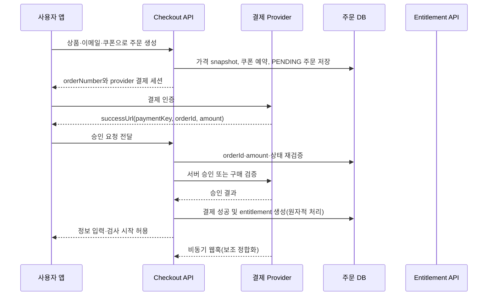

# 휴심컬러 결제·회원·PDF·관리자 공통 플랫폼 구현 전 설계안

작성일: 2026-09-12
작성자: Manus AI
범위: **설계 검토만 수행**. 앱의 컬러심리 해석, 결과 문장, 개인·관계 검사 로직, 결과 UI, 현재 PDF 레이아웃은 수정하지 않는다.

> **법률·개인정보 유의사항**: 본 문서는 구현을 위한 기술 설계안이며 정식 법률 자문이 아닙니다. 결제·이메일·신앙 정보·심리 결과의 보관 기간, 동의 문구, 위탁 처리와 파기 기준은 실제 도입 전 개인정보 및 전자상거래 전문 검토를 권장합니다.

## 설계 결론

휴심컬러는 각 화면에 결제 로직을 직접 붙이는 방식이 아니라, **상품 → 주문 → 결제 거래 → 구매권한 → 이용 세션 → 결과 스냅샷 → PDF → 이메일**의 공통 흐름을 새 서버 계층으로 분리하는 것이 적절합니다. 토스페이먼츠와 Google Play는 결제 사실을 검증하는 **provider adapter**로만 두고, 고객이 실제로 유료 분석을 시작할 수 있는지는 provider가 아닌 공통 `entitlement`가 판단합니다. 이 구조면 향후 1:1 코칭도 같은 주문·쿠폰·관리자 시스템을 쓰면서, 분석과 달리 예약·진행 상태만 별도 fulfillment로 확장할 수 있습니다.

토스 결제는 클라이언트의 성공 화면이 아니라 서버의 주문 금액 검증과 승인 API 응답이 모두 성공한 뒤 권한을 부여해야 합니다. 토스 공식 흐름도 결제 요청 전에 주문번호·최종금액을 서버에 저장하고, 성공 URL의 값과 재대조한 후 서버 승인 API를 호출하도록 안내합니다.[1] Google Play 역시 앱 콜백만으로 열지 않고 서버에서 구매를 검증한 뒤 entitlement를 부여하는 흐름을 요구합니다.[5] [8]

## ① 현재 구조

현재 프로젝트는 Expo Router 기반의 React Native Web/모바일 앱, TypeScript, tRPC, Drizzle/MySQL, Vercel 정적 번들 및 개별 serverless function 배포로 구성되어 있습니다. 프로덕션은 GitHub `main` push 시 GitHub Actions가 Expo 웹 번들을 만들고, 명시된 API 함수만 Vercel Build Output API 형태로 배포합니다.

| 영역 | 현재 구현 | 설계상 판단 |
|---|---|---|
| 상품 진입 | 첫 화면에서 무료 체험·개인 심화·관계 분석을 구분하고 관계는 3개 상품 선택 화면으로 분리됨 | **유지**. 새 checkout은 해당 진입 이후에만 붙임 |
| 개인 심화 | 개인정보 → 컬러 3개 → 심리카드 3개 → 결과의 기존 흐름 | **유지**. 유료 진입 전 entitlement 검사만 추가 |
| 관계 분석 | 부부·연인, 부모·자녀, 친구의 기존 상품·정보입력·검사 흐름 | **유지**. 각 상품 선택 후 entitlement 또는 무료 grant 검사만 추가 |
| 기존 결제 | `payment_records`에 수동 입금 신청을 적고, 클라이언트 `AsyncStorage`의 `premiumUnlocked`를 설정 | 실제 입금 확인 전 유료 접근이 가능하므로 **새 유료 흐름의 권한 근거로 사용 금지** |
| 사용자 | `users`는 Manus OAuth `openId` 중심이며 이메일은 선택값 | 회원은 확장 가능하나 비회원 주문·이메일 연결 모델이 없음 |
| PDF | 개인·관계 PDF는 요청 시 serverless function에서 즉시 생성·다운로드하며 DB/스토리지 저장·메일 이력 없음 | 기존 렌더러는 보존하되, 유료 완료 후 immutable snapshot 기반 저장·발송 파이프라인을 추가 |
| 공유 | 관계 결과는 `shareId` immutable snapshot으로 저장·조회 | 공개 공유와 유료 PDF 보관은 별개 권한 모델로 유지 |
| 관리자 | 클라이언트 하드코딩 비밀번호와 공개 tRPC 입금·통계 API 기반 | 결제 도입 전에 서버 측 관리자 인증·권한 검사로 교체 필요 |
| 배포 | workflow가 tRPC, 부부·연인 PDF, 부모·자녀 PDF 함수만 명시 빌드 | 새 웹훅·checkout·PDF download·cron 함수를 workflow와 route config에 명시 추가해야 함 |

특히 현재 판매 소개 화면에는 개인 심화 가격이 **30,000원** 및 `qr_30000`으로 남아 있는 반면, 최신 상품 정의는 **29,000원**입니다. 새 시스템에서는 가격을 앱 화면 상수가 아니라 서버의 상품 가격 버전에서만 읽도록 하여 이 불일치를 제거해야 합니다. `payment_records`는 기존 운영 이력 보존용 legacy table로 남기고, 새 주문과 섞지 않습니다.

## ② 필요한 DB·백엔드·스토리지

### 권장 데이터 모델

금액은 모든 테이블에서 원화 정수(`amountKrw`)로 저장하고, 주문에 상품명·정가·할인·최종가를 **스냅샷**으로 남깁니다. 이후 상품 가격이나 쿠폰이 바뀌어도 과거 주문의 금액이 변하지 않습니다.

| 테이블 | 핵심 필드 | 역할 |
|---|---|---|
| `customers` | `id`, `emailEncrypted`, `emailHash`, `userId?`, `emailVerifiedAt`, `status` | 비회원과 회원의 공통 구매 주체. 이메일 인증 후 회원 계정과 연결 |
| `auth_identities` | `customerId`, `provider`, `providerSubject`, `verifiedAt` | Manus·카카오·네이버 등 로그인 수단을 여러 개 연결 |
| `products` | `code`, `name`, `fulfillmentType`, `active`, `requiresPayment` | 분석·향후 코칭을 한 카탈로그로 관리 |
| `product_prices` | `productId`, `amountKrw`, `currency`, `validFrom`, `validTo`, `version` | 가격 변경 이력과 checkout용 유효 가격 |
| `provider_product_mappings` | `productId`, `provider`, `providerProductId`, `packageName?` | 토스 상품명 및 Google Play 상품 ID 매핑 |
| `orders` | `orderNumber`, `customerId?`, `guestEmailHash`, `status`, `currency`, `listAmountKrw`, `discountAmountKrw`, `finalAmountKrw`, `expiresAt` | 장바구니/결제 단위. 토스 `orderId`에도 사용 |
| `order_items` | `orderId`, `productId`, `productNameSnapshot`, `priceVersion`, `listAmountKrw`, `discountAmountKrw`, `finalAmountKrw`, `fulfillmentType` | 상품별 주문 스냅샷. 초기에는 1건 주문도 허용 |
| `payment_transactions` | `orderId`, `provider`, `providerPaymentId`, `providerOrderId`, `status`, `idempotencyKey`, `approvedAt`, `rawPayloadEncrypted?` | 결제 시도와 승인/취소/환불 상태 기록 |
| `entitlements` | `customerId?`, `orderItemId?`, `productId`, `status`, `usageLimit`, `usedCount`, `validUntil?`, `source` | provider와 분리된 실제 구매권한. `active`, `reserved`, `consumed`, `revoked`, `expired` 상태 |
| `assessment_attempts` | `entitlementId?`, `productId`, `relationType?`, `status`, `resumeTokenHash`, `startedAt`, `completedAt` | 새로고침·뒤로가기를 견디는 검사 단위. 한 entitlement는 한 attempt를 재개 |
| `analysis_results` | `attemptId`, `resultId`, `snapshotEncrypted`, `contentHash`, `completedAt` | 실제 선택값과 기존 분석 결과를 고정 저장. PDF의 유일한 데이터 원본 |
| `coupons` | `code`, `discountType`, `discountValue`, `minOrderAmountKrw`, `startsAt`, `endsAt`, `maxRedemptions`, `maxPerCustomer`, `status` | 정액/정률·최소금액·기간·총/고객별 사용 제한 |
| `coupon_product_rules` | `couponId`, `productId` | 적용 가능한 분석·코칭상품 지정 |
| `coupon_redemptions` | `couponId`, `orderId`, `customerId?`, `state`, `reservedAt`, `consumedAt`, `releasedAt` | 동시 사용을 막는 쿠폰 예약·확정 이력 |
| `pdf_reports` | `resultId`, `storageKey`, `checksum`, `status`, `generatedAt`, `expiresAt`, `lastError` | PDF 생성·private 저장·만료·재생성 관리 |
| `email_deliveries` | `reportId`, `customerId?`, `recipientEncrypted`, `providerMessageId`, `status`, `attemptCount`, `nextAttemptAt`, `lastError` | 발송 요청/전달/반송/재시도 이력 |
| `outbox_jobs` | `type`, `aggregateId`, `dedupeKey`, `status`, `attemptCount`, `runAfter`, `lockedUntil`, `lastError` | PDF 생성·메일 발송·상태 재조정의 durable job queue |
| `webhook_events` | `provider`, `externalEventId`, `eventType`, `payloadEncrypted?`, `receivedAt`, `processedAt`, `processingStatus` | 토스·Resend·Google Play 재전송/중복 이벤트 방지 |
| `admin_audit_logs` | `adminUserId`, `action`, `entityType`, `entityId`, `beforeJson`, `afterJson`, `createdAt` | 쿠폰·환불·재발송·예약 상태 변경 감사 |
| `coachings` | `orderItemId`, `customerId?`, `status`, `scheduleAt?`, `meetingType?`, `notes` | 향후 대면/온라인 코칭 fulfillment 확장. 예약금이 아닌 **코칭 상품 전액 결제 완료** 후에만 예약 상태를 생성 |

`users.openId`를 즉시 삭제하지 않습니다. 1단계에서는 기존 `users`를 회원 계정의 기반으로 유지하고 `customers.userId`와 연결합니다. 향후 카카오·네이버 도입 때 `auth_identities`를 추가하여 한 고객이 여러 로그인 수단을 연결하도록 합니다.

### 안전한 저장 방식

결과 snapshot, 이메일, 나이·직업·신앙 여부, PDF 파일 키는 일반 방문 통계나 공개 공유 데이터와 분리합니다. DB에는 검색·중복 방지에 필요한 이메일 HMAC hash와 암호화된 원문을 구분 저장하며, 결과 snapshot과 PDF는 앱 번들·공개 URL·browser storage에 장기 보관하지 않습니다. 암호화 키는 서버 비밀 관리에 두고 키 버전(`encryptionKeyVersion`)을 함께 기록해 향후 회전 가능하게 설계합니다.

PDF bytes는 서버에서 생성한 뒤 private object storage에 UUID 기반 key로 저장합니다. 사용자가 받는 다운로드는 `/api/reports/{reportId}/download`에서 로그인 소유자 또는 이메일 일회용 인증 세션·주문 소유 관계를 확인한 뒤, 짧은 유효시간의 storage URL로 302 이동하거나 서버 스트리밍으로 제공합니다. storage key 자체나 영구 링크는 이메일 본문과 관리자 목록에 노출하지 않습니다. 현재 제공된 저장소 helper는 key 기반 signed redirect를 지원하지만, 심리 결과는 key를 아는 것만으로 접근하게 두지 않고 반드시 이 앱의 권한 확인 endpoint를 앞단에 둡니다.

## ③ 결제 아키텍처

### 공통 checkout과 provider adapter

`CheckoutService`가 주문 생성, 쿠폰 산정, 결제 시도 생성, provider 호출 준비를 담당합니다. 각 provider는 다음과 같은 공통 계약으로 분리합니다.

| 공통 메서드 | 토스 구현 | Google Play 구현 | 테스트 구현 |
|---|---|---|---|
| `createPaymentSession` | 클라이언트에 토스 결제창용 orderId·amount·client key 정보 반환 | 앱에서 Play 상품 조회 후 구매 흐름 시작 | 성공/실패/취소 fixture 반환 |
| `verifyAndCapture` | 서버에서 `paymentKey/orderId/amount` 재검증 후 confirm | 서버에서 purchase token과 상품 ID를 Developer API로 조회 | 설정된 상태를 반환 |
| `handleWebhook` | 상태 변경·가상계좌 입금·취소 이벤트 정합화 | RTDN 수신 후 Developer API 재조회 | 이벤트 fixture 처리 |
| `cancelOrRefund` | paymentKey 기준 취소 API | Play 주문/환불 정책에 맞는 별도 운영 절차 | 상태 전이만 수행 |



### 토스페이먼츠 상세 흐름

1. 사용자가 유료 상품과 이메일을 입력하면 서버가 transaction 안에서 유효 상품 가격·쿠폰·최종금액을 계산하고 `orders`, `order_items`, `payment_transactions(status=READY)` 및 쿠폰 reservation을 만든다.
2. 서버가 만든 `orderNumber`와 서버 산정 `finalAmountKrw`만 클라이언트에 반환한다. 화면의 가격이나 할인 계산값은 승인 근거가 아니다.
3. 토스 결제창 성공 URL은 `paymentKey`, `orderId`, `amount`를 전달한다. 전용 승인 API가 DB 주문의 상태·금액·통화·만료·쿠폰 hold를 대조한 뒤에만 토스 confirm을 호출한다.[1]
4. 토스 confirm 요청에는 내부 transaction ID 기반 `Idempotency-Key`를 넣고, 같은 승인 요청은 같은 DB 행을 잠가 재사용한다. 토스는 POST 요청의 멱등키를 15일간 보장하지만, 앱은 그보다 오래 주문/거래 상태를 보존한다.[3]
5. confirm 결과가 `DONE`이면 단일 DB transaction에서 결제 거래 성공, 주문 paid, 쿠폰 redemption consumed, entitlement active, outbox job 생성을 확정한다. 이미 성공한 경우 기존 결과만 반환한다.
6. 사용자 취소·실패·30분 만료는 주문을 `CANCELLED/FAILED/EXPIRED`로 기록하고 coupon reservation을 해제한다. 토스의 결제 객체는 `READY`, `IN_PROGRESS`, `DONE`, `CANCELED`, `ABORTED`, `EXPIRED` 상태를 제공하므로 내부 상태 전이는 이를 보존하되 더 넓은 주문 상태로 매핑한다.[4]
7. 토스 웹훅은 성공 URL의 보조 안전망이며 특히 가상계좌 같은 비동기 수단의 정합화에 사용한다. 웹훅은 재전송될 수 있으므로 `externalEventId`/결제키 및 상태 전이로 idempotent하게 처리하고, DB 저장이 끝난 뒤 200을 반환한다.[2]

### 중복 클릭·새로고침·뒤로가기 방지 규칙

| 상황 | 서버 동작 |
|---|---|
| 결제 버튼 연속 클릭 | 동일 고객·상품·유효 쿠폰의 미완료 주문이 있으면 새 주문 대신 기존 `orderNumber` 반환 |
| success URL 새로고침 | confirm endpoint는 transaction row lock과 idempotency key로 기존 승인 결과 반환 |
| 승인 요청 타임아웃 | provider 확인 전에는 `PROCESSING`으로 기록하고 동일 키로 재확인; 새 결제 권한을 임의 생성하지 않음 |
| 뒤로가기 후 재결제 | 미결제 주문은 재개하거나 만료 후 새 주문 생성. 쿠폰 hold는 주문 만료 시 해제 |
| 동일 provider 결제키 재전송 | `provider_payment_id` unique 제약으로 한 payment transaction에만 연결 |
| 무료 상품 진입 | 주문을 만들지 않고 `grant_type=FREE` entitlement 또는 익명 attempt를 발급. 결제 API는 호출하지 않음 |
| 결제 후 검사 중 새로고침 | entitlement의 `assessment_attempt`와 resume token을 재사용. 같은 구매로 두 결과를 만들지 않음 |

## ④ 회원·비회원 구조

회원가입은 결제 전 필수 조건이 아닙니다. checkout 최초 화면에서 이메일을 받되, 비회원은 이메일 인증 코드 또는 magic link로만 구매 내역·PDF에 접근합니다. 이때 이메일만 URL이나 local storage에 보관하지 않고, 짧은 시간의 hashed one-time token과 HTTP-only 세션을 사용합니다.

| 흐름 | 고객 식별 | 결제 후 접근 | 향후 회원 전환 |
|---|---|---|---|
| 비회원 | `customers`의 verified email | 이메일 코드 인증 후 주문·PDF·결과 내역 확인 | 같은 verified email 또는 주문 검증 후 기존 customer와 계정 연결 |
| Manus 회원 | `users` + `customers.userId` | 로그인 세션으로 entitlement·결과·PDF 조회 | 현재 OAuth 흐름 유지 |
| 카카오/네이버 회원 | `auth_identities(provider, subject)` | 같은 customer에 연결 | provider별 OAuth callback만 추가 |

회원과 비회원 모두 결제 완료 직후에는 **entitlement → 정보 입력 → 검사**로 이동합니다. 분석 결과에는 `assessment_attempt`를 연결하며, 관계 상품은 한 주문/권한에 두 사람의 기존 입력값을 하나의 attempt payload로 보관합니다. 부부·연인과 부모·자녀의 현재 입력 항목과 결과 로직은 바꾸지 않습니다.

## ⑤ PDF·이메일 구조

현재 PDF API는 현재 화면에서 받은 payload를 즉시 PDF로 만들어 다운로드만 제공하므로, 이메일·재시도·접근 제어에는 적합하지 않습니다. 새 구조는 완료된 `analysis_results.snapshotEncrypted`를 유일한 원본으로 사용합니다. 기존 `createPremiumPdfBuffer`, `createCouplePdfBuffer`, `createParentChildPdfBuffer`의 문장·레이아웃 코드는 유지하고, 입력 출처만 브라우저 payload에서 서버의 immutable result snapshot으로 바꿉니다.

1. **유료 분석 entitlement에 연결된** 검사 완료 API가 결과 snapshot과 content hash를 먼저 원자적으로 저장한다. 무료 컬러 체험과 친구 관계 분석은 현재 정책대로 자동 PDF·이메일 발송 대상에서 제외한다.
2. 같은 transaction에서 `GENERATE_PDF:{resultId}` outbox job을 unique enqueue한다.
3. PDF worker가 결과 snapshot을 복호화해 기존 렌더러로 Buffer를 만들고 private storage에 저장한 뒤 `pdf_reports=GENERATED`로 업데이트한다.
4. `SEND_RESULT_EMAIL:{reportId}` job이 PDF Buffer를 private storage에서 읽어 이메일 첨부로 보낸다. 초기 권장 구현체는 Resend이지만 `EmailProvider` 인터페이스로 분리한다. Resend는 attachment를 지원하고, 중복 발송 방지용 idempotency key도 제공한다.[9] [10]
5. `email_deliveries`에는 API 요청 성공과 실제 delivery/bounce webhooks를 별도 기록한다. 웹훅은 at-least-once, 순서 비보장이라 provider event ID를 unique 처리한다.[11]
6. 관리자에서는 생성 실패·발송 실패의 오류 원인, 시도 횟수, 마지막 시각을 보고 **PDF 재생성** 또는 **이메일 재발송**을 실행한다. 재실행은 새 결과를 만들지 않고 같은 result snapshot을 사용한다.

다음 두 방안이 현실적입니다. 현재 트래픽과 Vercel 플랜이 확정되지 않았으므로 지금은 한 가지를 고정하지 않습니다.

| 접근 | 장점 | 한계 | 적합한 시작점 |
|---|---|---|---|
| **요청 즉시 생성 + DB outbox + 일일 재조정** | 현재 Vercel 배포에 가장 적은 인프라 추가. 결과 완료 직후 PDF·메일을 바로 시도하고, 실패 건은 다음 재조정에서 처리 | 무료 Vercel Cron은 하루 1회이며 실패 자체를 자동 재시도하지 않음 | 초기 판매량이 낮고, 관리자 수동 재발송이 가능한 단계 |
| **DB outbox + 분 단위 scheduler/managed queue worker** | 수분 내 자동 재시도, 장애 후 대량 복구, 더 명확한 작업 관찰성 | 추가 서비스·플랜·운영 설정 필요 | 판매량 증가, 당일 재시도 SLA, 이메일 실패 자동 복구가 필요한 단계 |

Vercel Cron은 보안 헤더 `CRON_SECRET`을 지원하지만 실패 호출을 자동 재시도하지 않으며, 중복·누락도 가능한 best-effort 호출입니다. 따라서 어느 방안이든 outbox 잠금과 state-based reconciliation이 필수입니다.[13] [14] 무료 플랜은 하루 한 번만 실행할 수 있으므로, 짧은 주기 재시도는 플랜 조건 검토가 선행돼야 합니다.[15]

## ⑥ 관리자 구조

새 관리자는 클라이언트 비밀번호 비교와 `publicProcedure`를 사용하지 않습니다. 기존 `users.role=admin`을 서버에서 확인하는 `adminProcedure`를 만들고, 최소 한 명의 운영자를 DB migration 또는 안전한 owner bootstrap으로 지정합니다. 관리자 비밀번호 원문·기본값은 앱 번들, local storage, public API에 두지 않습니다. 로그인·쿠폰 변경·수동 환불·PDF 재발송·예약 변경에는 `admin_audit_logs`를 남깁니다.

관리자 홈은 아래 파이프라인을 하나의 주문 상세 타임라인으로 표현합니다.

```text
고객/회원 → 주문 → 주문상품 → 쿠폰 → 결제거래 → 구매권한
→ 검사 attempt → immutable 결과 → PDF → 이메일 전달
→ (향후 코칭) 예약 → 진행 → 완료
```

| 관리자 영역 | 필수 기능 |
|---|---|
| 요약 대시보드 | 기간별 주문·결제 성공·쿠폰 사용·검사 완료·PDF 생성·메일 delivered/bounced·미처리 job |
| 고객/회원 | 이메일 인증 상태, 연결 계정, 주문 이력, entitlement, 데이터 삭제 요청 상태 |
| 상품/가격 | 상품 활성화, 가격 버전 예약, 채널별 provider product mapping, 코칭/디지털 fulfillment 구분 |
| 주문 상세 | 금액 snapshot, 쿠폰, 결제 provider 상태, provider transaction ID, entitlement, 검사/결과/PDF/email 타임라인 |
| 쿠폰 | 생성·중지, 정액/정률, 기간, 총/고객별 제한, 최소금액, 적용 상품, reservation/사용 내역 |
| 결과·PDF·메일 | 결과 존재 여부, PDF 저장 상태, 보안 다운로드, 이메일 상태, 재생성/재발송 |
| 코칭 확장 | 전체 금액 결제 후 예약 요청·확정·일정 변경·진행 완료·취소 상태 |
| 운영 안전 | 관리자 역할, 감사 로그, webhook 실패 큐, dead-letter 작업, 환불/권한 취소 기록 |

## ⑦ Google Play 확장 구조

Android 앱에서 디지털 분석 상품을 판매할 때는 `GOOGLE_PLAY` provider를 추가하되, 앱의 entitlement와 별개로 관리합니다. Google Play는 디지털 상품용 결제 시스템이며 실제 대면/온라인 코칭처럼 디지털 콘텐츠 외 서비스의 적용 가능성은 Play 정책과 판매 형태를 별도 확인해야 합니다.[8]

1. `provider_product_mappings`에 `personal_deep`, `couple_love_deep`, `parent_child_deep`의 Play one-time product ID를 등록한다.
2. Android 앱은 Play Billing Library로 상품·현지 가격을 조회하고 결제를 시작한다. 최신 공식 문서는 모든 신규 앱/업데이트가 2026-08-31부터 Billing Library 8 이상을 사용해야 한다고 안내한다.[5]
3. 앱은 `purchaseToken`, Play product ID, package name, `obfuscatedAccountId`를 서버로 전송한다. 서버는 `purchases.products.get`으로 실제 구매/확인 상태를 검증하고, 이미 처리한 purchase token인지 확인한 뒤 entitlement를 생성한다.[7]
4. 구매 처리 후 앱은 acknowledge한다. 서버 검증과 entitlement 부여 전에는 결과·검사 진입을 열지 않는다.[5]
5. RTDN은 Cloud Pub/Sub에서 받고, message ID 중복을 막은 후 Developer API를 다시 조회해 취소·무효화·환불 상태를 entitlement에 반영한다. RTDN payload 자체는 완전한 상태가 아니므로 재조회가 필요하다.[6]

이 설계에서는 같은 고객이 웹에서 토스로 산 개인 심화와 Android에서 Play로 산 개인 심화를 모두 하나의 `entitlements` 목록에서 사용합니다. 다만 플랫폼별 환불·취소가 생기면 해당 provider 구매에 연결된 entitlement만 revoke하고, 이미 완료된 결과·PDF 보존/접근 정책은 별도 환불 정책에 따라 결정합니다.

## ⑧ 구현 순서와 예상 위험요소

### 권장 구현 순서

| 단계 | 구현 범위 | 완료 기준 |
|---|---|---|
| 0. 기준 확정 | 상품 코드·29,000원 가격·환불/유효기간·결과/PDF 보관 정책·이메일 발신 도메인 결정 | 가격·보관·환불 정책을 문서화하고 legacy 30,000원 화면을 신규 checkout에서 배제 |
| 1. 기반 보안 | prod/dev DB 분리 확인, schema migration, 서버 `adminProcedure`, secret 관리, audit log | 클라이언트 하드코딩 관리자 비밀번호와 공개 결제 관리 API 제거 |
| 2. 카탈로그·주문·쿠폰 | products/prices/orders/coupons/redemption 및 server-side 금액 계산 | 쿠폰 동시 사용·만료·최소금액·정률 상한 테스트 통과 |
| 3. 토스 adapter | 주문 생성, 결제창, success 승인, 웹훅, 멱등 상태 전이, entitlement 생성 | 토스 테스트키로 성공/실패/취소/새로고침/중복 클릭을 모두 검증 |
| 4. 이용 세션 연결 | entitlement → 개인정보 → 기존 검사 → immutable result 저장 | 기존 개인·부부·부모·친구 분석 문장/결과가 같은 입력에서 동일함을 snapshot 비교 |
| 5. PDF·메일 | private storage, report/email outbox, 다운로드 권한, Resend 또는 선택 provider, 관리자 재시도 | PDF 생성 실패·메일 반송·재발송이 주문 타임라인에서 추적됨 |
| 6. 관리자 | 주문 상세 타임라인·쿠폰·작업 실패함·권한/감사로그 | 운영자가 고객부터 이메일 상태까지 하나의 화면에서 조회·조치 가능 |
| 7. Google Play | product mapping, native Billing, server verification, RTDN, 환불/void 처리 | 내부 테스트 트랙에서 구매/복구/취소/무효화 entitlement가 일치 |
| 8. 코칭 확장 | coaching fulfillment와 예약 상태, 전체 결제 후 예약 동선 | 분석·코칭이 같은 주문/쿠폰/관리자 구조에서 작동 |

### 자동 검수 설계

개발 환경에서는 `TestPaymentProvider`를 사용해 실제 금액 이동 없이 결제 성공·실패·취소·중복 승인·웹훅 재전송을 재현합니다. 테스트 전용 provider는 production build에서 활성화될 수 없도록 환경 allowlist를 둡니다. 토스는 테스트 키와 sandbox를 사용하고, Google Play는 internal testing track 및 purchase token fixture를 분리합니다.[1] [5]

| 상품 | 결제 여부 | 자동 E2E 검증 |
|---|---:|---|
| 무료 컬러 체험 | 없음 | 상품 선택 → free grant/attempt → 결과. 주문·결제 미생성 확인 |
| 개인 심화 29,000원 | 토스/테스트 | 주문·쿠폰 → 성공 승인 → entitlement → 기존 정보/검사 → 결과 snapshot → 개인 PDF → 이메일 |
| 부부·연인 59,000원 | 토스/테스트 | 상품별 entitlement → 기존 두 사람 입력/검사 → 관계 결과 → 기존 관계 PDF → 이메일 |
| 부모·자녀 39,000원 | 토스/테스트 | 상품별 entitlement → 기존 입력/검사 → 부모·자녀 결과/PDF → 이메일 |
| 친구 관계 무료 | 없음 | 친구 free grant → 기존 입력/검사 → 결과. 결제 호출 없음 |

또한 다음 속성/통합 테스트를 필수로 둡니다: 가격 위변조 거부, 쿠폰 한도 동시성, 하나의 토스 paymentKey 중복 승인 거부, success URL 반복 안전성, 웹훅 중복/순서 역전 안전성, 한 entitlement의 attempt 재개, 환불 후 권한 변경, PDF checksum 일치, 비회원 이메일 인증 없이는 PDF 다운로드 거부, 이메일 중복 발송 방지, 결과 공유 `shareId`와 private report 권한의 완전한 분리입니다.

### 주요 위험과 대응

| 위험 | 영향 | 대응 |
|---|---|---|
| 클라이언트 가격/결제 완료 플래그 신뢰 | 무료 유료 검사 접근·금액 위변조 | 서버 가격 snapshot·provider 승인 검증·entitlement만 권한 근거로 사용 |
| 현재 manual 입금 테이블을 신규 주문에 재사용 | 주문/환불/쿠폰/감사 불가 | legacy 보존, 신규 orders/payment_transactions 분리 |
| 현재 PDF가 화면 payload를 바로 받음 | 결과 조작·재생성/메일 추적 불가 | 서버 immutable result snapshot만 PDF 입력으로 사용 |
| 심리·신앙 데이터와 공개 링크 혼합 | 민감 정보 노출 | 공개 shareId와 private result/PDF 스토리지·권한 endpoint 분리 |
| Vercel prebuilt 배포가 API 자동 인식한다고 가정 | 새 webhook/worker가 Production 누락 | workflow에 함수·의존성·routes·cron config를 명시 추가 |
| 웹훅/cron 재전송·중복·누락 | 중복 권한·중복 이메일·작업 유실 | unique event 기록, DB lock, outbox dedupe, reconciliation |
| 관리자 클라이언트 비밀번호/공개 API | 주문·개인정보 조작 위험 | 서버 인증·역할 검사·감사 로그를 결제 도입의 선행 조건으로 설정 |
| dev/prod DB 혼용 | 테스트 데이터 또는 migration이 운영 데이터에 영향 | 별도 `DATABASE_URL`, migration 승인 절차, 백업·복구 리허설 |
| provider 키/웹훅 비밀의 프런트 노출 | 승인/메일 악용 | server-only secret, IP/서명/secret 검증, 키 회전 계획 |

## 구현 전 결정이 필요한 네 가지 항목

1. PDF와 결과의 기본 보관 기간, 비회원 재열람 기간, 삭제 요청 처리 기준을 확정해야 합니다.
2. 토스 결제수단 범위(카드·간편결제만 우선인지, 가상계좌까지 포함인지)를 정해야 웹훅/비동기 승인 범위를 확정할 수 있습니다.
3. 이메일 발신 도메인과 선택 provider(초기 권장: Resend)를 확정해야 DNS 검증·반송 모니터링을 준비할 수 있습니다.
4. 코칭 상품의 예약 시스템을 자체 일정 관리로 시작할지, 외부 예약 도구와 연결할지 정해야 `coachings`의 상세 필드와 관리자 동선을 확정할 수 있습니다.

## References

[1]: https://docs.tosspayments.com/guides/v2/get-started/payment-flow "토스페이먼츠 결제 흐름 이해하기"
[2]: https://docs.tosspayments.com/en/webhooks "Toss Payments — Integrate webhooks"
[3]: https://docs.tosspayments.com/reference/using-api/authorization "토스페이먼츠 인증 및 기타 헤더 설정"
[4]: https://docs.tosspayments.com/reference "토스페이먼츠 코어 API"
[5]: https://developer.android.com/google/play/billing/integrate "Google Play Billing integration"
[6]: https://developer.android.com/google/play/billing/rtdn-reference "Google Play RTDN reference"
[7]: https://developers.google.com/android-publisher/api-ref/rest/v3/purchases.products/get "Google Play Developer API — purchases.products.get"
[8]: https://developer.android.com/google/play/billing "Google Play's billing system"
[9]: https://resend.com/docs/dashboard/emails/attachments "Resend attachments"
[10]: https://resend.com/docs/dashboard/emails/idempotency-keys "Resend idempotency keys"
[11]: https://resend.com/docs/dashboard/webhooks/introduction "Resend webhooks"
[12]: https://resend.com/docs/dashboard/emails/introduction "Resend transactional email"
[13]: https://vercel.com/docs/cron-jobs "Vercel Cron Jobs"
[14]: https://vercel.com/docs/cron-jobs/manage-cron-jobs "Managing Vercel Cron Jobs"
[15]: https://vercel.com/docs/cron-jobs/usage-and-pricing "Vercel Cron Jobs usage and pricing"
